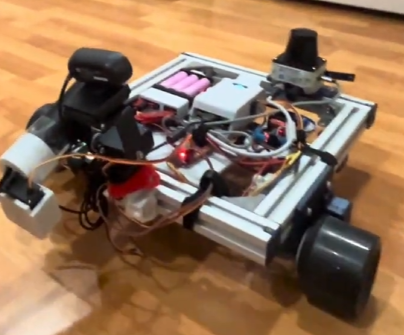

# Autonomous LIDAR-Guided Balloon Targeting Rover

Autonomous robotic system integrating LIDAR-based navigation and computer vision for real-time target tracking and engagement.

## Demo Video
[Watch Demo](https://youtu.be/bCVy1L1Pw5s)

Demonstrates autonomous navigation using LIDAR and vision-based target tracking with real-time control.

## System Overview

Final SCUTTLE platform with integrated LIDAR, camera system, and pan-tilt targeting mechanism.

## Overview
This project involves the development of a differential-drive robotic platform capable of navigating its environment autonomously using LIDAR data while detecting and tracking colored targets using computer vision.

The system combines perception, control, and actuation to perform real-time decision-making and target engagement.

## Key Features
- Autonomous navigation using LIDAR-based obstacle detection  
- Computer vision-based color target detection and tracking  
- PID-controlled pan-tilt system for camera alignment  
- Real-time motor control with encoder feedback  
- Laser activation triggered by confirmed target tracking  

## System Architecture

### Perception
- LIDAR used for obstacle detection and navigation  
- Camera used for color-based target detection  
- Pixel offset converted into control error  

### Control
- PID controller used to align camera with target  
- Differential drive control for robot movement  
- Real-time adjustment based on sensor feedback  

### Actuation
- DC motors for mobility  
- Pan-tilt servo system for camera positioning  
- Laser activation system for target engagement  

## My Contributions
- Implemented LIDAR-based obstacle avoidance logic  
- Developed OpenCV-based computer vision pipeline for color detection and tracking  
- Designed PID control system for pan-tilt camera tracking  
- Integrated sensors, motor drivers, encoders, and control logic into a modular system  
- Contributed to fabrication, assembly, and gimbal integration  

## Technologies Used
- Python  
- OpenCV (computer vision)  
- TiM561 LIDAR  
- DC motors with encoders  
- Servo motors (pan-tilt system)  
- L298N motor driver  

## Documentation
[View Full Lab Report](docs/scuttle-lidar-vision-report.pdf)  
[View Final Presentation](docs/final_presentation.pdf)

Includes detailed system design, LIDAR navigation logic, computer vision pipeline, PID control implementation, and mechanical design of the turret system.

## Project Structure
- `/code` -> Control scripts and system logic  
- `/media` -> Images and diagrams  
- `/docs` -> Lab report and presentation  

## What I Learned
- Integrating multiple sensing systems (LIDAR + vision)  
- Applying PID control in real-time robotic systems  
- Designing perception-to-control pipelines  
- Building modular and scalable robotic systems  
