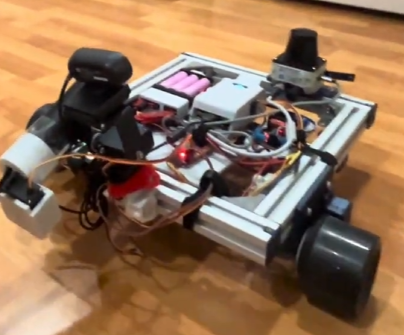

# Autonomous LIDAR-Guided Balloon Targeting Rover

Autonomous robotic system integrating **LIDAR-based navigation**, **computer vision**, and **PID-controlled target tracking** on a differential-drive rover platform.

## Demo
[Watch Demo Video](https://youtu.be/bCVy1L1Pw5s)



## Project Summary
This project uses a SCUTTLE robotic platform to navigate with LIDAR scan data while detecting and tracking colored targets through a camera. The system combines perception, control, and actuation so the rover can react to obstacles, align a pan-tilt mechanism with a target, and trigger target engagement logic once tracking is confirmed.

## Key Features
- LIDAR-based obstacle detection and autonomous navigation
- OpenCV color segmentation for real-time target detection
- PID-controlled pan-tilt camera alignment
- Differential-drive motor control with encoder feedback
- Modular layered software architecture for sensors, control, and behaviors
- Laser activation logic based on confirmed target tracking

## System Architecture

| Layer | Purpose | Example Components |
|---|---|---|
| L1 Hardware Interface | Direct sensor/actuator access | camera, LIDAR, motors, servos, logging |
| L2 Control/Processing | reusable control and perception logic | color detection, PID, telemetry, speed control |
| L3 Behaviors | system-level behaviors | camera tracking, obstacle avoidance |
| L4 Mission Logic | final integrated behavior | target acquisition and engagement |

## My Contributions
- Implemented LIDAR-based obstacle avoidance logic using real-time scan data.
- Developed OpenCV-based target detection and tracking pipeline.
- Designed PID control logic to convert target pixel offset into pan/tilt corrections.
- Integrated camera, LIDAR, motors, encoders, and servo control into a modular system.
- Contributed to fabrication, assembly, turret/gimbal integration, and final testing.

## Technologies Used
- Python
- OpenCV
- TiM561 LIDAR
- DC motors with encoders
- Servo motors / pan-tilt mechanism
- L298N motor driver
- Node-RED telemetry visualization

## Results
- Demonstrated real-time target detection and camera tracking.
- Integrated LIDAR obstacle sensing with rover motion control.
- Created a layered software structure that separated hardware access, perception, control, and mission behavior.
- Validated the full system through final demo testing and documentation.

## Repository Structure
```text
software/   Python control, perception, telemetry, and robot behavior code
docs/       Final report and presentation
media/      Robot images and diagrams
```

## Documentation
- [Full Lab Report](docs/scuttle-lidar-vision-report.pdf)
- [Final Presentation](docs/final_presentation.pdf)

## Notes for Future Improvement
- Add dependency/setup instructions for running on the SCUTTLE/Raspberry Pi environment.
- Add a wiring/interface diagram for sensors and actuators.
- Add recorded telemetry plots or screenshots from the final demo.

## What I Learned
- Integrating multiple sensing systems in a real robotic platform
- Building perception-to-control pipelines
- Applying PID control to a physical pan-tilt mechanism
- Debugging real-time sensor, motor, and camera interactions
- Structuring robotics code into modular layers
